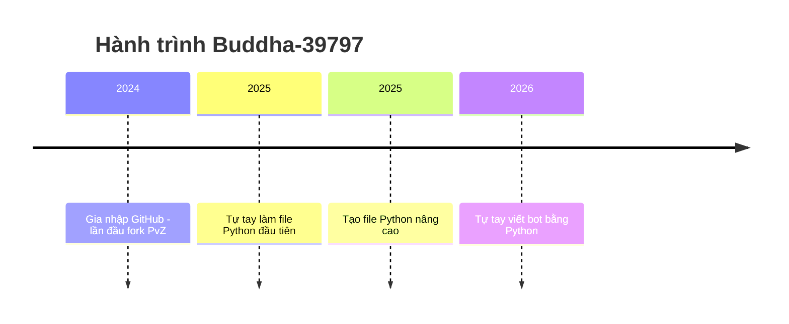

<h1 align="center">🚀 SliXeR-14 - Hành trình từ lớp 6 đến huyền thoại của GitHub 🚀</h1>
<p align="center">
  
</p>

<p align="center">
  
  
</p>
<p align="center">
</p>
<p align="center">
  
  
</p>


## 🎮 Ai đây? Chính là mình nè!
- 🧠 12 tuổi, học lớp 6 – nhưng không phải "trẻ trâu code dạo" đâu nhé!
- 💻 Dân code Python chính hiệu, chuyên săn file `.py hoặc pyw`
- 🔧 Fork mọi repo Python nhìn thấy
- 🤖 Fan cuồn code automation
- ⚽ Fan cuồng cầu thủ nổi tiếng nhất thế giới: Cristiano Ronaldo

---

## 📈 GitHub Stats của mình

<p align="center">
  
  
</p>
<p align="center">

---

## 🔮 Tính cách qua badge

<p align="center">
  
  
</p>

---

## 🧠 Quote chất lượng

> “Trẻ em cũng có thể lập trình ra thế giới!” – *SliXeR-14*  
> “Mod PvZ là đam mê, còn git push là thở” – *Bro said that*

---

## 🔥 Dự án nổi bật

<table style="width:100%">
  <thead>
    <tr>
      <th>💾 <strong>Repo</strong></th>
      <th>🔥 <strong>Mô tả</strong></th>
      <th>🔗 <strong>Link</strong></th>
    </tr>
  </thead>
  <tbody>
    <tr>
      <td><strong>SliXeR-14</strong></td>
      <td><p align="center">⚡ Repo gốc gác của huyền thoại.
          <p align="center">🧠 Mỗi commit = 1% IQ tăng!
          <p align="center">💾 Fork là đam mê, bug là bạn thân 😎.</td>
      <td><a href="https://github.com/SliXeR-14/SliXeR-14">🔎 Xem ngay</a></td>
      <tr>
       <tr>
        <td><strong>Mega-Tools</strong></td>
      <td>Nó là một Repository về <strong>Tool</strong>, giúp bạn trong cuộc sống rất nhiều và được làm bởi <strong>SliXeR-14</strong>.</td>
      <td><a href="https://github.com/SliXeR-14/Mega-Tools">🔎 Xem ngay</a></td>
         </tr>
       <tr>
  </tbody>
</table>

---

## 🛠 Công cụ yêu thích

<p align="center">
  
  
  
  
</p>

---

## 🧪 Skill tree của mình

```
💡 Lập trình Cơ bản:  ███████░░░░░ 70%
🌿 Cheat:             ██████████░ 95%
⚙️ Git/GitHub:        ██████░░░░░ 60%
🧩 Meme Power:        ██████████ 100%
🎨 Sáng tạo Markdown: ████████░░░ 80%
```

---

## ⌛ Timeline hành trình



---

## 🎨 Fan art yêu thích

<p align="center">
  
  
</p>
<!-- Hai hình đầu căn giữa, cùng kích thước -->
<p align="center">
  
  
</p>
<p align="center">
  <i>🔧 Tui chỉ chỉnh nhẹ thôi mà... 💥 | Chỉnh sửa thế giới là đến lúc tui đạt tới cảnh giới.!</i>
</p>

<!-- Hình thứ ba cũng ở giữa và cùng kích thước -->
<p align="center">
  
  <br/>
  <i>🌟 Một follow thôi cũng làm tim tui đập mạnh hơn (thật đó 😳)</i>
</p>

---

## 📬 Liên hệ

<p align="center">
  <a href="mailto:nguyenminhhuykt2014@gmail.com">
    
  </a>
</p>

---

<p align="center"><b>🌟 Cảm ơn bạn đã xem đến đây! Đừng quên thả sao ⭐ nếu bạn thích nha!</b></p>

<p align="center">
<a href="https://github.com/Buddha-39797">
    
  
</p>
