  

<h1 align="center">🚀 SliXeR-14 - Hành trình từ lớp 6 đến huyền thoại GitHub 🚀</h1>

  

  
  

---

## 🎮 Ai đây? Chính là mình nè!
- 🧠 12 tuổi, học lớp 6 – nhưng không phải "trẻ trâu code dạo" đâu nhé!
- 💻 Dân code Python chính hiệu, chuyên săn file `.py, pyw hoặc .cpp`
- 🔧 Fork mọi repo Python và C++ nhìn thấy
- 🤖 Fan cuồn code automation
- ⚽ Fan cuồng Cristiano Ronaldo

---
## 🥇 Tên Ansi-Shadown của mình

---

           ███████╗██╗     ██╗██╗  ██╗███████╗██████╗        ██╗██╗  ██╗
           ██╔════╝██║     ██║╚██╗██╔╝██╔════╝██╔══██╗      ███║██║  ██║
           ███████╗██║     ██║ ╚███╔╝ █████╗  ██████╔╝█████╗╚██║███████║
           ╚════██║██║     ██║ ██╔██╗ ██╔══╝  ██╔══██╗╚════╝ ██║╚════██║
           ███████║███████╗██║██╔╝ ██╗███████╗██║  ██║       ██║     ██║
           ╚══════╝╚══════╝╚═╝╚═╝  ╚═╝╚══════╝╚═╝  ╚═╝       ╚═╝     ╚═╝                                                

---

## 🥈 Tên Ansi-Regular của mình

---

           ███████ ██      ██ ██   ██ ███████ ██████         ██ ██   ██ 
           ██      ██      ██  ██ ██  ██      ██   ██       ███ ██   ██ 
           ███████ ██      ██   ███   █████   ██████  █████  ██ ███████ 
                ██ ██      ██  ██ ██  ██      ██   ██        ██      ██ 
           ███████ ███████ ██ ██   ██ ███████ ██   ██        ██      ██                                                         
                                                   
---
## 📈 GitHub Stats

  
  

  

---

## 🔮 Tính cách qua badge

  
  

---

## 🧠 Quote chất lượng

> “Trẻ em cũng có thể lập trình ra thế giới!” – *SliXeR-14*  
> “Mod PvZ là đam mê, còn git push là thở” – *Bro said that*

  

---

## 🔥 Dự án nổi bật

<table style="width:100%">
  <thead>
    <tr>
      <th>💾 <strong>Repo</strong></th>
      <th>🔥 <strong>Mô tả</strong></th>
      <th>🔗 <strong>Link</strong></th>
    </tr>
  </thead>
  <tbody>
    <tr>
      <td><strong>SliXeR-14</strong></td>
      <td>⚡ Repo gốc gác của huyá»n thoại. 🧠 Mỗi commit = 1% IQ tăng! 💾 Fork là đam mê, bug là bạn thân 😎.</td>
      <td><a href="https://github.com/SliXeR-14/SliXeR-14">🔎 Xem ngay</a></td>
    </tr>
    <tr>
      <td><strong>Mega-Tools</strong></td>
      <td>Repository về <strong>Tool</strong>, giúp ích trong cuộc sống, được làm bởi <strong>SliXeR-14</strong>.</td>
      <td><a href="https://github.com/SliXeR-14/Mega-Tools">🔎 Xem ngay</a></td>
    </tr>
  </tbody>
</table>

---

## 🛠 Công cụ yêu thích

  
  
  
  

---

## 🧪 Skill tree của mình

💡 Lập trình Cơ bản: ███████░░░░░ 70% 

🌿 Cheat:            ██████████░ 95% 

⚙️ Git/GitHub:       ██████░░░░░ 60% 

🧩 Meme Power:       ██████████ 100% 

🎨 Sáng tạo Markdown:████████░░░ 80%

---

## ⌛ Timeline hành trình

```mermaid
timeline
    title Hành trình SliXeR-14
    2024 : Gia nhập GitHub - lần đầu fork PvZ
    2025 : Tự tay làm file Python đầu tiên
    2025 : Tạo file Python nâng cao
    2026 : Tự tay viết bot bằng Python
```

---

## 🎉 Fun Facts
- 🐍 Viết script Python nhanh hơn làm toán trên lớp 😆

- 🎮 PvZ Modder tương lai – biến zombie thành… Ronaldo cũng được!

- 🛠 Bug không phải kẻ thù, bug là sensei dạy mình code giỏi hơn.

---

## 🎨 Fan art yêu thích

  
  

<!-- Hai hình đầu căn giữa, cùng kích thước -->

  
  

  <i>🔧 Tui chỉ chỉnh nhẹ thôi mà... 💥 | Chỉnh sửa thế giới là đến lúc tui đạt tới cảnh giới.!</i>

<!-- Hình thứ ba cũng ở giữa và cùng kích thước -->

  
   
  <i>🌟 Một follow thôi cũng làm tim tui đập mạnh hơn (thật đó 😳)</i>

---

## 📬 Liên hệ

    

---

## 🙏 Cảm ơn

<b>🌟 Cảm ơn bạn đã xem đến đây! Đừng quên thả sao ⭐ nếu bạn thích nha!</b>

   

 <img src="https://capsule-render.vercel.app/api?type=waving&color=gradient&height=120&section

---
